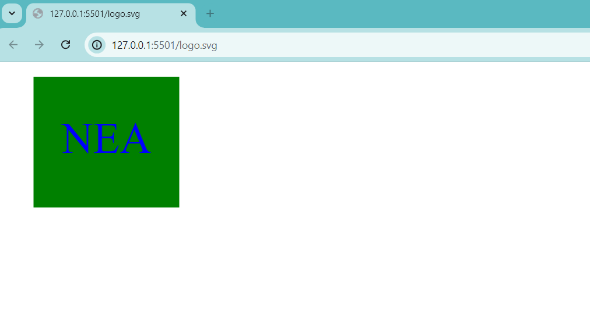

# SVG-Logo-Maker

This project is licensed under the [MIT License](https://opensource.org/licenses/MIT).

## Description

This repo is for an app that helps the user automate an SVG log maker. The user is prompted to chose their color, their shape, and the text. The app turns these choices into an SVG file with their logo. The project utilizes many OOP techniques and tests the functionality of each code.

  ## Table of Contents
  - [Installation](#installation)
  - [Usage](#usage)
  - [License](#license)
  - [Contributing](#contributing)
  - [Tests](#tests)
  - [Questions](#questions)

  ## Installation
  
  To get started, follow these steps:

  1. Clone the repository:
        'git clone https://github.com/nearias3/SVG-Logo-Maker.git'
  2. Navigate to your repository, then install the dependencies:
        'npm install inquirer' 'npm install jest'
  3. Run the application
        'node index.js'

  ## Usage

  

  [Click Here To View The Video Walkthrough](https://drive.google.com/file/d/1Lw8cqzKD9UeN_zZBxFLPFj9EVfoSaqs0/view?usp=sharing)

  ## License
    
  Please refer to the license in the repo.

  ## Contributing

  Useful information about coding, including tutorials and guides, as well as the starter code for this project, were provided by the UT Bootcamp GitLab: [https://git.bootcampcontent.com/University-of-Texas-at-Austin/UTA-VIRT-FSF-PT-05-2024-U-LOLC/].

  The MIT license badge and a guide to writing that code: [https://daily.dev/blog/github-markdown-badges-explained#how-to-add-badges-to-your-github-repository]

  I frequently referred to Mozilla's developer tool blogs (MDN Web Docs) for help identifying the correct code and syntax: [https://developer.mozilla.org/en].

  For assistance in building the code necessary to generate my SVG file, I referred to Stack Overflow: [https://stackoverflow.com/questions/63192003/how-to-use-svg-polygon-to-create-triangle]

  ## Tests
  
  To run tests, navigate to the 'lib' directory and use "npm test"

  ## Questions

  You can find more of my work at [nearias3](https://github.com/nearias3).